### Using entropy metrics for automatic dataset processing.

#### Entropy for dataset column values
Suppose, a column in a dataset has cells with values `C1`..`Cn`,
and these values belong to the set of values `V1`..`Vk`.

Given, that these values have probabilities `p_1`..`p_k`,
the entropy for the values of the column is `H = - Sum[1..k](p_i * log(p_i))`.

For instance, for the dataset
```
Last name | Name   | City       | Planet
----------+--------+------------+-------
Smith     | George | London     | Earth
Brown     | Henry  | York       | Earth
Wright    | George | Manchester | Earth
Johnson   | Henry  | Liverpool  | Earth
```
Entropy values are for this example are:
```
C1        | C2     | C3         | C4
----------+--------+------------+-------
2         | 1      | 2          | 0
```

#### Entropy gap
For the dataset above, it's clear, that given a last name, one can tell the first name, but not vice versa.

We can define the concept of 'entropy gap' `G(C2|C1)` between two dataset columns `C1` and `C2`
as the average number of bits of information to be supplied to tell the value in `C2` column,
given the information about the value in `C1` column.

In the example, `G(C2|C1)=0` and `G(C1|C2)=1`.
E.g., given first name=`Henry`, last name can be either `Brown` or `Johnson`,
and 1 bit of information is required to resolve ambiguity.
Averaging over all values, we will get `G=1`.

More formally, entropy gap is defined as weighted conditional entropy:
`G(B|A) = p(A=a1)*H(B|A=a1) + p(A=a2)*H(B|a2) ...`


#### Entropy graph
The values for column entropy and entropy gaps can be displayed in a graph.
E.g., for the example above

```puml
@startuml
digraph foo {
  rankdir=LR
  node [style=rounded shape=box]
  C1 [label="C1\nH=2"]
  C2 [label="C2\nH=1"]
  C1 -> C2 [label="G=0"]
  C2 -> C1 [label="G=1"]
}
@enduml
```



#### The task for automatic column ordering for 'good' dataset presentation

Sometimes it might be useful to automatically order dataset columns for display to human beings.

First, let's discuss what column ordering might be 'good'.

The suggestion is to display more 'informative' columns first.
E.g., for the example dataset, the value for the column `Planet` is always `Earth`,
and does not give much information. If this column is displayed last and possibly goes off-screen,
it is not a problem.

We can use entropy as a metric for informativeness of the column, 
and display columns in the order of decreasing entropy.

However, using entropy alone might not always give good results.


#### The task for automatic dataset sorting for 'good' presentation

Sorting the dataset on some columns will bring the repeated values in columns together,
making it easier for the human to understand the data, leading to 'good' dataset presentation.

The suggestion is to sort dataset by columns, starting from the least informative (with the smallest entropy)
to the most informative (with the smallest entropy).

It's possible also to use entropy gap between columns.
E.g., after column Cx, use a column Cy, such that `G(Cy|Cx)` is minimal.
Even better is to a column Cy use a such that `G(Cy|C1,C2..Cy)` is minimal.