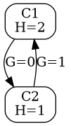

### Using entropy metrics for automatic dataset column ordering and dataset aggregation.

#### Entropy for dataset column values
Suppose, a column in a dataset has cells with values `C1`..`Cn`,
and these values belong to the set of values `V1`..`Vk`.

Given, that these values have probabilities `p_1`..`p_k`,
the entropy for the values of the column is `H = - Sum[1..k](p_i * log(p_i))`.

For instance, for the dataset
```
Smith   | George
Brown   | Henry
Wright  | George
Johnson | Henry
```
`H=2` for the 1st column and `H=1` for the 

#### Entropy gap
For the dataset above, it's clear, that given a last name, one can tell the first name, but not vice versa.

We can define the concept of 'entropy gap' `G(C2|C1)` between two dataset columns `C1` and `C2`
as the average number of bits of information to be supplied to tell the value in `C2` column,
given the information about the value in `C1` column.

In the example, `G(C2|C1)=0` and `G(C1|C2)=1`.
E.g., given first name=`Henry`, last name can be either `Brown` or `Johnson`,
and 1 bit of information is required to resolve ambiguity.
Averaging over all values, we will get `G=1`.

More formally, entropy gap is defined as weighted conditional entropy:
`G(B|A) = p(A=a1)*H(B|A=a1) + p(A=a2)*H(B|a2) ...`

#### Entropy graph
The values for column entropy and entropy gaps can be displayed in a graph.
E.g., for the example above


